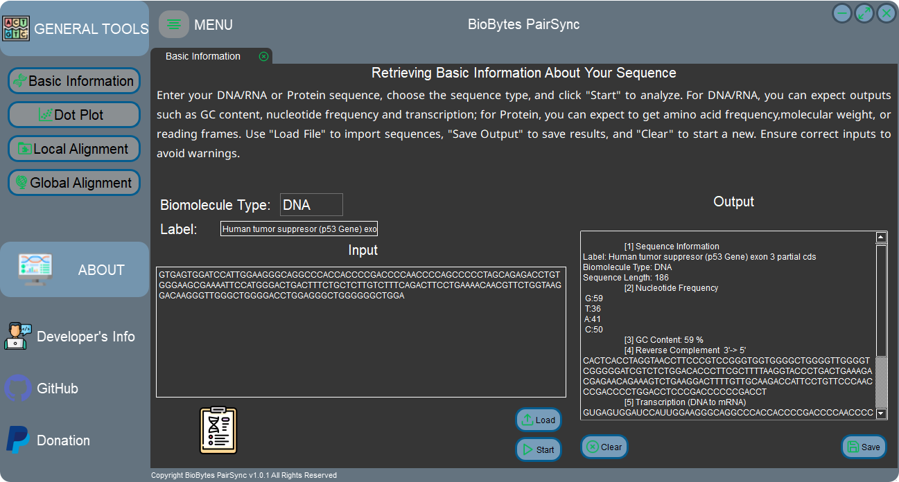
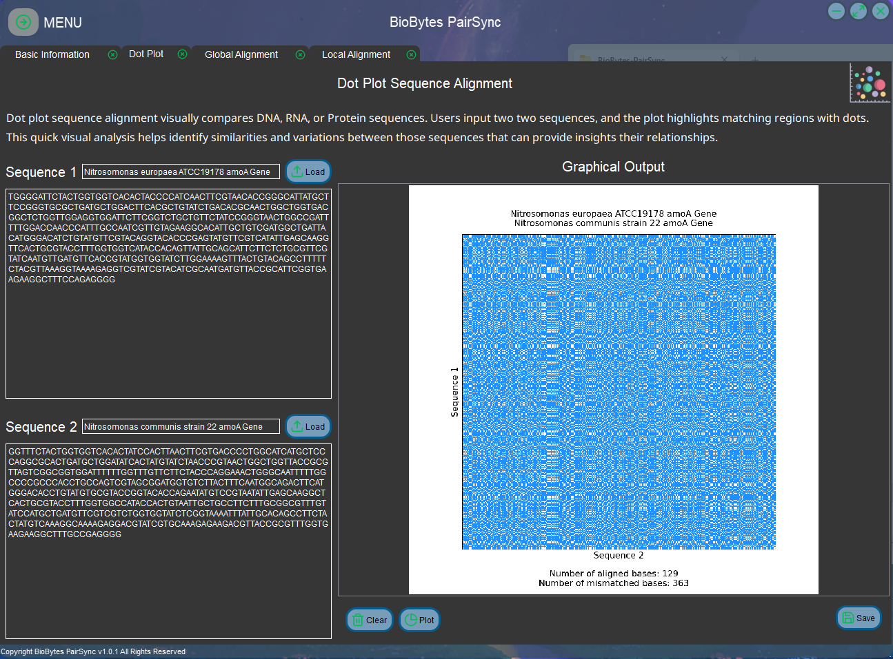

### BioBytes PairSync: A Bioinformatics Tool for Basic Information Retrieval and Pairwise Sequence Alignment

### Demo

This GUI app allows users to input biological sequences, either manually or by loading from a file. It supports DNA, RNA, and Protein sequences. Users can retrieve various information about the input sequence, such as **nucleotide or amino acid frequency**, **GC content**, **reverse complement**, **transcription**, **translation**, **amino acid molecular weight**, **isoelectric point**, and **open reading frames**.

Users can save the output information to a text file and clear the output section for a clean slate. Additionally, loading sequences from <mark style= "background-color: rgba(0,128,128,0.5); color: #fff">FASTA or text files</mark> is supported, making it convenient for users to work with existing sequence data.

Enjoy exploring the functionalities provided by this GUI app for basic sequence analysis!

## Usage

### Basic Information

- Please select the **Biomolecule Type** of your data (_DNA, RNA, or Protein_).

- Add a **Label** (Optional). It would add _"No Sample Label Added"_ if no entry added

- Add the sequence **Input Box**. Make sure it is in correct format and without whitespaces. NCBI URL is also accepted under the Nucleotide Database.

- You can **Clear** the output or **Save** it as _.txt file_

### Dot Plot Alignment

- Input your first and second sequence at **Sequence 1** and **Sequence 2** box respectively. Additionally, it is optional to add a **Label**

- Take note that whitespaces and totally unequal lengths prompts error and not allowed for this alignment

_It is highly recommended to add Label as it would appear in the plot_

- The **Plot Button** allows to generate the Dot Plot with associated information of match & mismatch bases/amino acids.

- The output can be saved by clicking the **Save Button** as _.png file_

### Local and Global Alignment

- Both Local and Global Alignment had the same _User Interface Layout_ but they differ in the algorithm used since they have different purpose.

- Input your first and second sequence at **Sequence 1** and **Sequence 2** box respectively. Additionally, it is optional to add a **Label**

- Make sure no whitespaces included on the sequence and they are compatible for pairwise alignment (**sequence length** may be _different_ but not applicable for pair of sequences which has _large difference in length_)

- You can **Clear** the output or **Save** it as _.txt file_

Thank you for using my developed tool :ship:

#### Donations

Developer: _Bryan Castillo_

[Paypal! ](https://paypal.me/BryanAngeloCastillo)
It would help me to build more...
